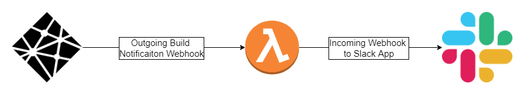
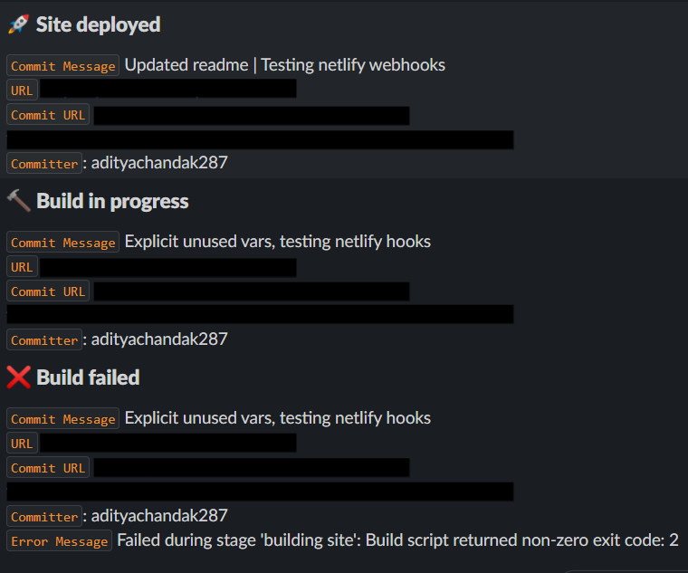

# Netlify Slack Webhook
  


Get around Netlify and Slack premium integrations by getting netlify build notifications sent to your slack channels using webhooks.

## `What is this?`

This project helps you get build notifications from netlify into your slack channel. The architecure looks something like this:



## `Instructions`

Want to use this project? Follow these steps:

### `Step 1`: **Setup Slack App to accept incoming webhooks**

Go to https://api.slack.com/apps

Create a new App. Enter name and choose workspace.

Under `Add features and functionality` choose `Incoming Webhooks`.

Toggle `Activate Incoming Webhooks` on.

Add new webhook to workspace -> Select the `channel` you wish to receive message notifications in -> Allow

Make note of the `Webhook URL`, we will need it in the later steps.

### `Step 2`: **Deploy AWS Lambda Function**

I used [Serverless](https://www.serverless.com/) to package and deploy the function. You can use your service of choice.

Make sure your `.env` file looks like `.env.sample`. Paste the `Webhook URL` from above as the `SLACK_HOOK_URL`

```bash
npm install -g serverless
serverless deploy
# If you want to deploy to a specific AWS profile
serverless deploy --aws-profile <specific-aws-profile>
```

Make note of the `API Gateway Endpoint` after the function is deployed.

Note:

- Make sure your AWS credentials are set correctly.
- You can change the way the messages look by referring to https://api.slack.com/messaging/composing

### `Step 3`: **Setup outgoing Webhooks on Netlify**

Go to your site on netlify.

Site Settings -> Build & Deploy -> Deploy Notifications

Add Notification -> Outgoing Webhook

Enter the `API Gateway Endpoint` we got from deploying the AWS Lambda.

Note: You will have to do this for every event you want to get a notification for.

## `Demo`

This is what the messages look like in Slack.


